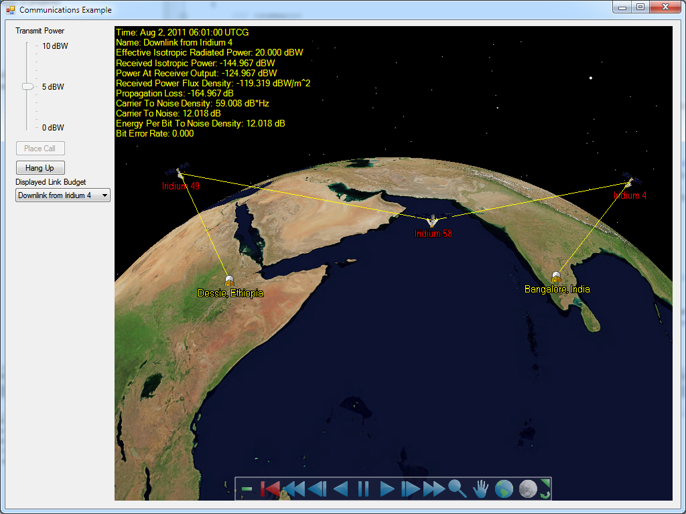

# Communications Demo

This application uses the **Communications Library** to setup a call between two locations and visualize the scenario and link budget results. Using [SimpleDigitalTransmitter](https://help.agi.com/AGIComponents/html/T_AGI_Foundation_Communications_SimpleDigitalTransmitter.htm), [Transceiver](https://help.agi.com/AGIComponents/html/T_AGI_Foundation_Communications_Transceiver.htm) and [SimpleReceiver](https://help.agi.com/AGIComponents/html/T_AGI_Foundation_Communications_SimpleReceiver.htm), the application looks at the link budget for the call, allowing the user to vary the transmission power of the calling phone, and on which links to report the link budget parameters. The application also shows how visualization can be incorporated into an analysis scenario, bringing in Insight3D and its various platforms, markers and models. For more information on the Communications Library, see the [Communications](https://help.agi.com/AGIComponents/html/Communications.htm) topic.

