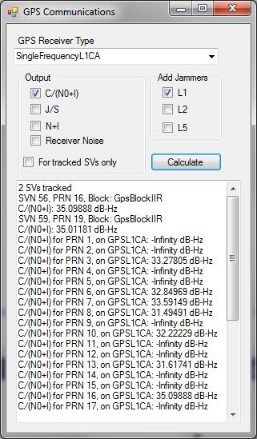

# GPS Communications Analysis

This application uses the **Communications Library**, the **Navigation Accuracy Library**, and the **Navigation Advanced Library** to model GPS communications at a site for a single time. You can select from nine different GPS signal configurations, and show four different communications metrics for GPS signals received by a [GpsReceiver](http://help.agi.com/AGIComponents/html/T_AGI_Foundation_Navigation_GpsReceiver.htm). Additionally, you can add jammers on either L1, L2 or L5 frequencies.

This example provides a good starting point for understanding the setup of a [GpsCommunicationsFrontEnd](http://help.agi.com/AGIComponents/html/T_AGI_Foundation_Navigation_Advanced_GpsCommunicationsFrontEnd.htm), configuring interference sources and retrieving link budgets for analysis. The [Navigation Communications](http://help.agi.com/AGIComponents/html/NavigationCommunications.htm) topic has more information on how this system works.

