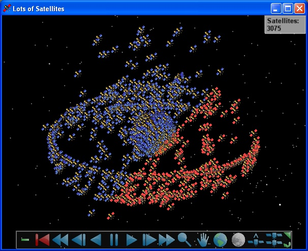

# Lots of Satellites

This application uses [Sgp4Propagator](https://help.agi.com/AGIComponents/html/T_AGI_Foundation_Propagators_Sgp4Propagator.htm) to propagate up to 10,000 satellites, which are visualized in Insight3D using [MarkerBatchPrimitive](https://help.agi.com/AGIComponents/html/T_AGI_Foundation_Graphics_MarkerBatchPrimitive.htm). Satellites shown in red have access to a ground station located in Australia.

