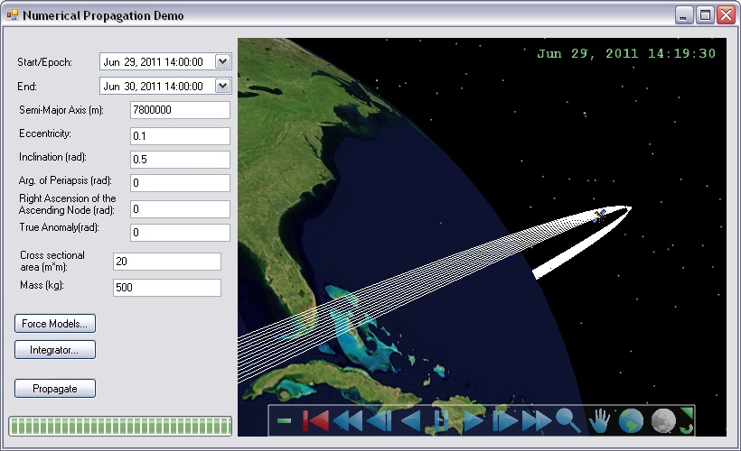

# Numerical Propagation Demo

This application uses a [NumericalPropagator](https://help.agi.com/AGIComponents/html/T_AGI_Foundation_Propagators_NumericalPropagator.htm) to propagate a satellite, which is then visualized in Insight3D using a [MarkerGraphicsExtension](https://help.agi.com/AGIComponents/html/T_AGI_Foundation_Platforms_MarkerGraphicsExtension.htm) and a [PathPrimitive](https://help.agi.com/AGIComponents/html/T_AGI_Foundation_Graphics_PathPrimitive.htm). Force models can be configured to act on the satellite's orbit being propagated, specifically: [SphericalHarmonicGravity](https://help.agi.com/AGIComponents/html/T_AGI_Foundation_Celestial_SphericalHarmonicGravity.htm), [TwoBodyGravity](https://help.agi.com/AGIComponents/html/T_AGI_Foundation_Celestial_TwoBodyGravity.htm), [SimpleSolarRadiationForce](https://help.agi.com/AGIComponents/html/T_AGI_Foundation_Celestial_SimpleSolarRadiationForce.htm), [ThirdBodyGravity](https://help.agi.com/AGIComponents/html/T_AGI_Foundation_Celestial_ThirdBodyGravity.htm), and [AtmosphericDragForce](https://help.agi.com/AGIComponents/html/T_AGI_Foundation_Celestial_AtmosphericDragForce.htm). A [RungeKutta4Integrator](https://help.agi.com/AGIComponents/html/T_AGI_Foundation_NumericalMethods_RungeKutta4Integrator.htm) or [RungeKuttaFehlberg78Integrator](https://help.agi.com/AGIComponents/html/T_AGI_Foundation_NumericalMethods_RungeKuttaFehlberg78Integrator.htm) can be configured for use by the propagator. The state described by the [NumericalPropagatorDefinition](https://help.agi.com/AGIComponents/html/T_AGI_Foundation_Propagators_NumericalPropagatorDefinition.htm) in this demo contains just a position and velocity representing one satellite. More generally, the state can contain any number of elements to be propagated including multiple positions, mass, or other parameters with their own differential equations. For more information see the [Orbit Propagation](https://help.agi.com/AGIComponents/html/OrbitPropagation.htm) topic.

