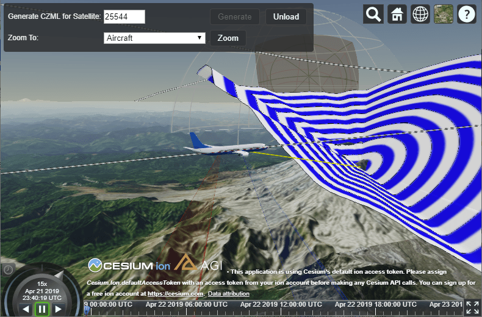

# Cesium Demo

This application demonstrates a client-server web application which uses STK Components on the server to perform analysis, and [STK Web Visualization Library](http://help.agi.com/AGIComponentsJava/html/StkWebVisualization.htm) on the client (in a web browser) to visualize the results of that analysis using CZML. It also includes demonstrations of each of the specialized graphical features available in STK Web Visualization Library.

To simplify the application and minimize dependencies, this application uses ASP.NET Web Forms to create a simple web service. Please note that use of STK Components, and the capabilities being demonstrated, are not specific to ASP.NET. STK Components can be integrated with STK Web Visualization Library using any web application framework.

The application also contains a small custom user interface to make it easier to explore the visualizations. This user interface is built using [Knockout.js](https://knockoutjs.com/) because it is already included in Cesium. As above, note that the capabilities being demonstrated can be used in any front-end framework.

## Features

This example demonstrates visualizing various types of Components objects and analysis, and the advanced graphical capabilities of STK Web Visualization Library, including:

* A satellite propagated from a TLE
* Access between a satellite and a ground station
* Using a link to target a satellite from a ground station
* An aircraft propagated from waypoints
* Azimuth-elevation mask visualization
* Access between an aircraft and a ground location constrained using a azimuth-elevation mask
* glTF 3D models for the satellite, facility, and aircraft
* Satellite orbit paths and aircraft flight paths
* Vectors showing the body axes of the satellite and the Sun vector
* Sensor volumes on a ground station and an aircraft, a sensor dome, and a rotating sensor
* Dynamically changing a glTF model based on analysis, to rotate the solar panels of the 3D satellite model to point at the sun

## Installation

This example requires STK Web Visualization Library, which is included with an STK Components license, and can be downloaded from [AGI's download site](https://support.agi.com/downloads/).

Unpack the contents of the `Build\Cesium` directory from the STK Web Visualization Library package into the `CesiumDemo\web\public\Cesium` directory before building and running the example.

Then, to compile this sample application with Ant:
  * Copy your AGI.Foundation.lic file into the src directory.
  * Run "ant package".  

The application will be compiled, packaged into a jar, and placed in the dist 
directory.  You can then double-click the CesiumDemo.jar file to run the 
application, or, simply run "ant run".

Then, connect to http://localhost:4567 in your browser to run the application.
