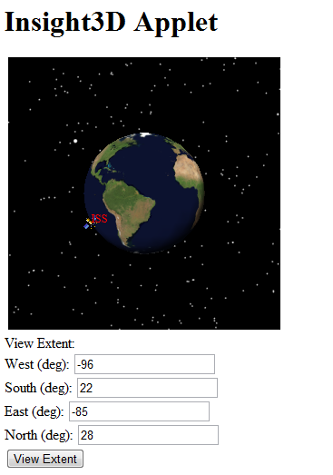

# Insight3DApplet

This Java applet demonstrates how to use Insight3D in a web browser, by using a Java Web Start JNLP file to load the native DLLs required by Insight3D, and shows how you can interact with your application from the browser via JavaScript.

## Implementation Notes

Because Insight3D has a native DLL library, special steps must be taken to allow an applet to load that native library. [Java Web Start](http://download.oracle.com/javase/tutorial/deployment/webstart/) provides a mechanism to indicate that certain JAR files contain native resources, which will be loaded automatically by the Java runtime before running the applet. These JAR files must be signed.

Java applets can be accessed from the browser via JavaScript. This example includes a very simple demonstration of how you can call a Java method from JavaScript, passing along user input from form elements on the page, and from there calling methods on Insight3D.

This example uses an [Ant](http://ant.apache.org/) build script to demonstrate how to create a JAR containing the Insight3D DLLs, how to sign the JARs with a certificate, and how to create a JNLP file that will load all the parts and run the applet.

## Compilation

To compile this sample applet with Ant:
  * Copy your AGI.Foundation.lic file into the src directory.
  * Run "ant package".  

The ant build script (build.xml) will do the following:
  * A JAR file, agi.foundation.graphics.native.x64.jar, 
    is built containing the Insight3D DLLs, as well as the VC140 runtime DLLs and manifest files.
    This is necessary because JNLP requires all native resources to be packaged
    into a JAR file to be loaded automatically.
  * The native JAR files and the JAR containing the applet code itself 
    are signed using a certificate.  The STK Components JAR files are already
    signed by AGI.  Details about the keystore used for signing are provided below.
  * A JNLP file is created by replacing a placeholder token with the names of 
    the STK Components JAR files.  This avoids making the example dependent on 
    a particular version of STK Components.
  * All JAR files, the JNLP file, and a HTML file loading the applet are placed 
    in the site directory.  

The most reliable way to test the applet is to copy the contents of the site 
directory to a location that will be served by a web server, then view the 
provided HTML file in your web browser over HTTP.  

Note: Depending on your web server, you may need to configure it to serve .jnlp files
with the appropriate MIME type: `application/x-java-jnlp-file`.  A web.config file for 
Microsoft IIS is included in the site directory.

This applet also demonstrates interacting with the applet through JavaScript.
When you click on the HTML button to View Extent, your browser calls a JavaScript 
function, which then calls a viewExtent method in Java on the applet itself, 
which then interacts with Insight3D to move the camera.

Keystore Information:

The provided keystore and certificate is for example purposes only.  Do not use 
this certificate for your own applet!  In a real applet, you should obtain a 
certificate from a certification authority, and sign your jars using that.  

See the Java documentation for more information:

[http://download.oracle.com/javase/tutorial/security/index.html](http://download.oracle.com/javase/tutorial/security/index.html)

This keystore has a password of "keystore", and contains a self-signed 
certificate under the alias "cert".  

For reference, this keystore was created using the following command:

`keytool -genkey -keystore keystore -storepass keystore -keypass keystore -alias cert -validity 3600 -dname "CN=demo, OU=demo, O=demo, L=demo, ST=PA, C=US" `
