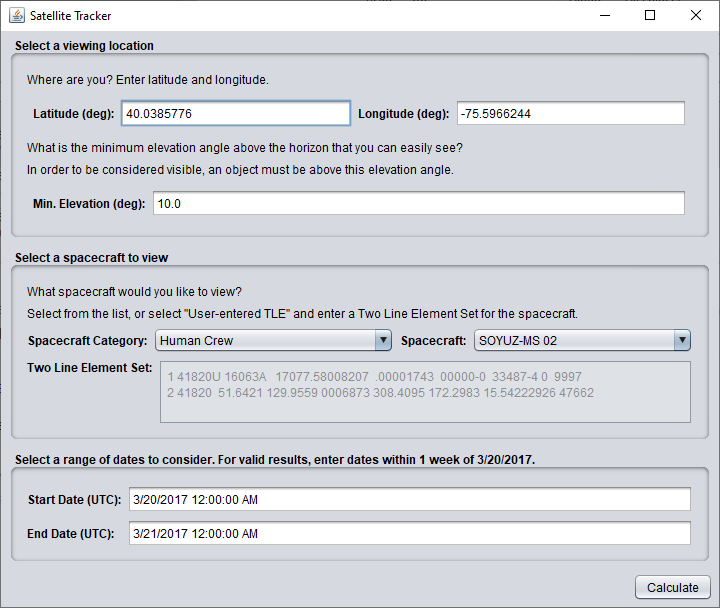
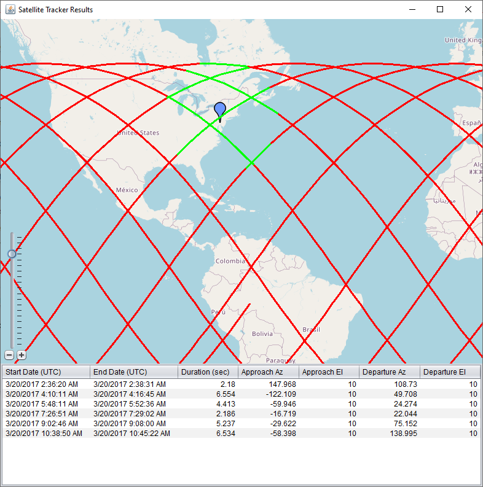

# Satellite Tracker

This Swing application computes access between a user-selected satellite viewed from a user-defined location during a user-specified time period, and generates ground tracks on an interactive map component, as well as producing a table of viewing opportunities.

For more information on the application, see [the topic for this example](https://help.agi.com/AGIComponentsJava/html/ExampleSatelliteTrackerJava.htm) in the STK Components documentation.

## Compilation

To compile this sample application with Ant:
  * Copy your AGI.Foundation.lic file into the src directory.
  * Run "ant package".  

The application will be compiled, packaged into a jar, and placed in the dist 
directory.  You can then double-click the SatelliteTracker.jar file to run the 
application, or, simply run "ant run".
